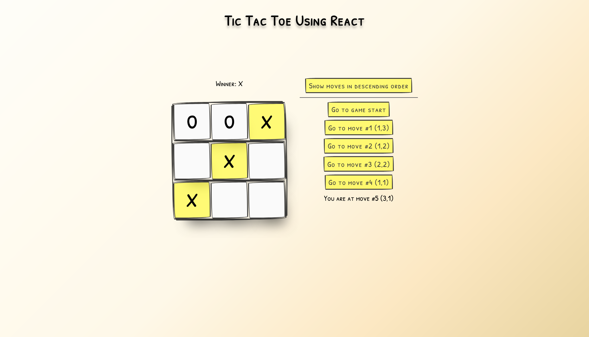

<!-- @format -->

# React Tic-Tac-Toe Game

## Tabel of Contents

- [Description](#description)
- [Features](#features)
- [Screenshot](#screenshot)
- [Links](#links)
- [Project Structure](#project-structure)
- [Code Overview](#code-overview)
- [Liscense](#license)

## Description

This project is a React implementation of the classic Tic-Tac-Toe game, demonstrating the use of React functional components, hooks, and state management.

## Features

- Playable 3x3 Tic-Tac-Toe board
- The ability to jump to previous moves
- Display of move coordinates
- Highlighting of winning squares
- Toggle for ascending/descending move order
- Draw detection

## Screenshot

## Links

- [code](https://github.com/ayx234/React_Learn_TIcTacToe)
- [live site](https://ayx234.github.io/React_Learn_TIcTacToe/)

## Project Structure

- `src/App.js`: Main game logic and components with inline documentation.
- `src/index.js`: Entry point for the React application.
- `src/styles.css`: Styles for the game layout and board.
- `README.md`: Project documentation.

## Code Overview

- **App.js** contains the main `Game` component, the `Board`, and `Square` components, as well as the game logic.
- Inline comments and JSDoc-style documentation are provided throughout the code for clarity.

## License

This project is for educational purposes.
